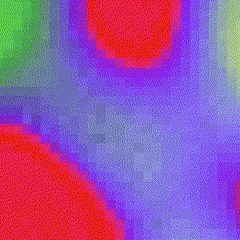

  

   
    &nbsp;
    &nbsp;
    &nbsp;
    &nbsp;
    &nbsp;
    &nbsp;
    &nbsp;
    &nbsp;

  

  

<!--
### Hi there 👋

**folders64/folders64** is a ✨ _special_ ✨ repository because its `README.md` (this file) appears on your GitHub profile

hi
[idk what im doing here](https://www.youtube.com/channel/UCIXmSFytM4aJfGicNe1ROUQ)

Here are some ideas to get you started:
- 🔭 I’m currently working on ...
- 🌱 I’m currently learning ...
- 👯 I’m looking to collaborate on ...
- 🤔 I’m looking for help with ...
- 💬 Ask me about ...
- 📫 How to reach me: ...
- 😄 Pronouns: ...
- ⚡ Fun fact: ...
-->
